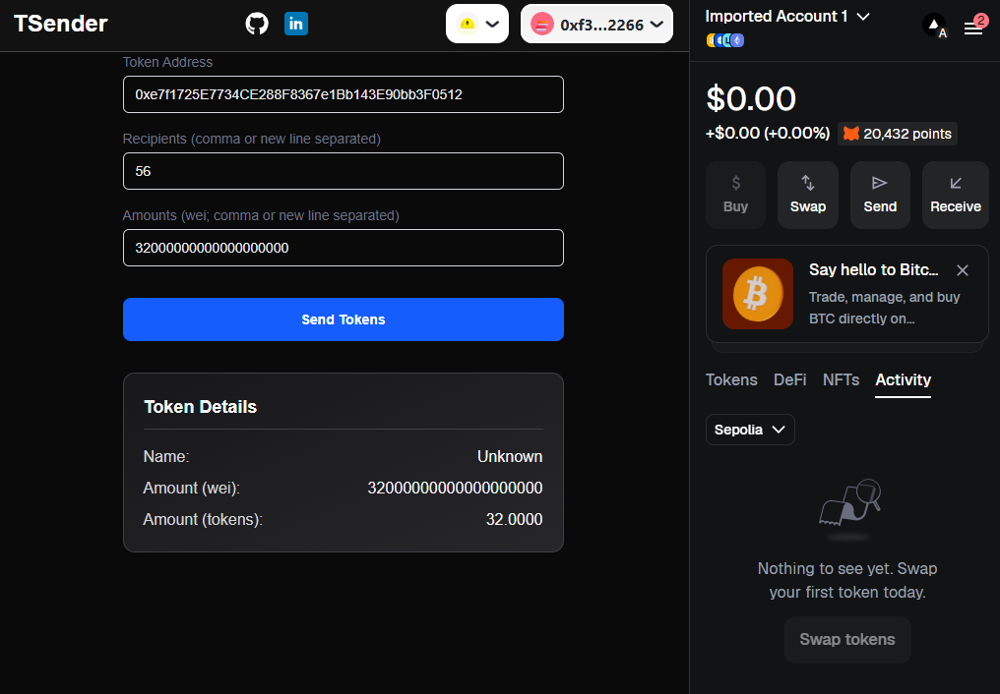

# Airdrops test tokens to a given address

[Live Demo](https://web-tsender-recreate.vercel.app/)

## Desctiption

Will airdrop a given token to a selected account(s).

Here is an example token on Sepolia:
- https://github.com/ssanin82/solidity-erc20-airdrop-sepolia-test
- XMAS123
- Address: 0x7Ee4c9f76324250C2d0277fa21fD812b5c0730c7

Mind you, it requires your account to be the owner of this token. Feel free to deploy your own tokens using this example repo to play around with ERC20 airdrops.

## Tech Stack
- React/Next.js
- pnpm
- Tailwind CSS
- Foundry
